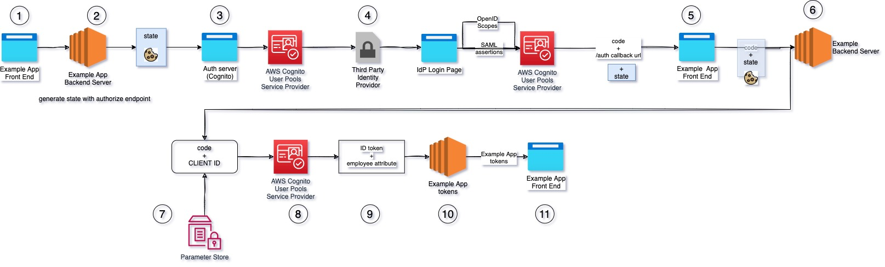

## Objective
Automated creation of Cognito User Pools which authorize the use of services. Each pool uses and external Idntity provider (IdP) for authentication. Each IdP can either be SAML or OICD compliant.
The following diagram shows the entire flow between application service with Cognito Authoirization server and third party IdP.


## Prerequisites
| Requirement | Description |
| ----------- | ----------- |
| Terraform | [Installation Instructions](https://learn.hashicorp.com/tutorials/terraform/install-cli) |
| AWS Account and CLI Credentials | [Create Account](https://console.aws.amazon.com/console/home) |
| Terraform Backend | [Setting up backend](https://www.terraform.io/language/settings/backends/s3)

## Installation

1. Create a state.tf file in the `setup` directory with AWS provider & AWS profile with admin access. 
Also recommended to store Terraform backend state and lock file in pre-configured S3 bucket and DynamoDB table.
2. Deploy using Terraform and AWS provider
```
cd setup
terraform plan -out infra-plan.json
terraform apply 
```
